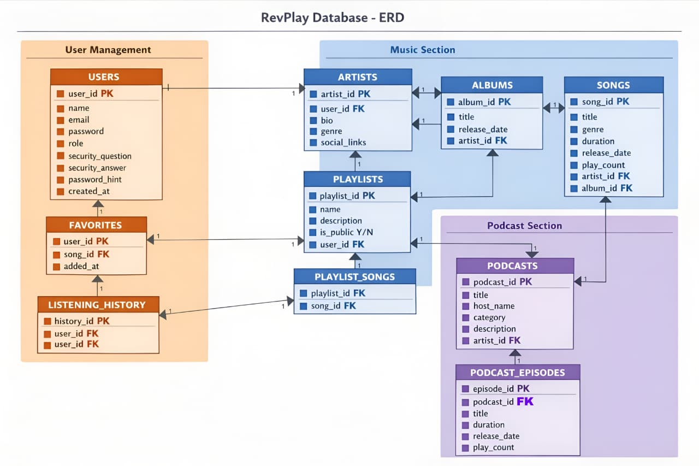
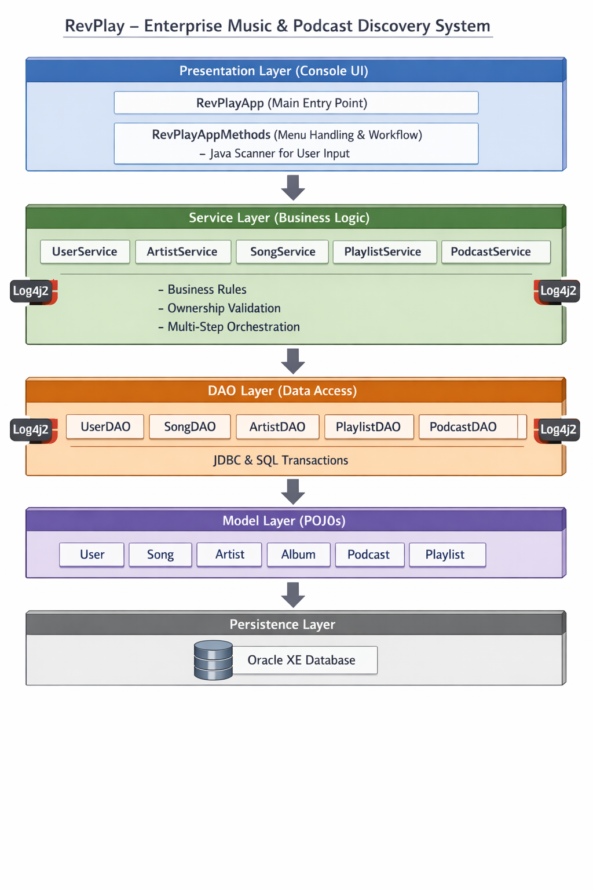
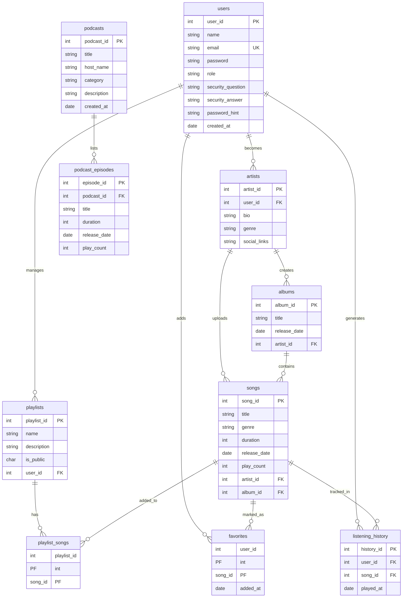

# 🎵 RevPlay - Enterprise Music & Podcast Management System

RevPlay is a comprehensive, enterprise-grade Java application designed for high-performance music and podcast streaming management. Built on the **N-Tier Architecture** pattern, it provides a feature-rich CLI environment for both casual listeners and professional creators.

---

## 📊 Entity Relationship Diagram (ERD)

<p align="center">
  
</p>

📌 This ERD represents all core entities such as Users, Artists, Albums, Songs, Podcasts, Playlists, Favorites, and Listening History along with their relationships, primary keys, and foreign key constraints.

## 🏛 Application Architecture (N-Tier / Layered Design)

<p align="center">
  
</p>

📌 The diagram illustrates the complete modular architecture of RevPlay:
- **Presentation Layer**: CLI-based interactive menus and handlers.
- **Service Layer**: Business logic, validation, and orchestration.
- **DAO Layer**: JDBC-based Data Access Objects for Oracle interaction.
- **Model Layer**: Plain Old Java Objects (POJOs) representing domain entities.
- **Database Layer**: Oracle 21c XE for persistent storage.


---

## 🧪 Testing & Code Quality

### Running Tests
RevPlay uses **JUnit 5** and **Mockito 5** for robust testing.
```bash
mvn test
```
To run the full test suite specifically:
```bash
mvn test -Dtest=SuiteClassMain
```

### Code Coverage (JaCoCo)
After running tests, a detailed coverage report is generated:
- **Report Location**: `target/site/jacoco/index.html`
- Open this file in any browser to view detailed coverage metrics.

---

## 🏗 Project Structure

```text
revplay/
├── src/main/java/com/revplay/
│   ├── main/               # Presentation Layer: Entry point and UI logic
│   ├── service/            # Service Layer: Business logic and implementations
│   ├── dao/                # Data Layer: JDBC database implementations
│   ├── model/              # Domain Layer: POJOs (User, Song, Podcast, etc.)
│   └── util/               # Utility Layer: DB Connection pool
├── src/test/java/com/revplay/test/ # Automated JUnit 5 test cases
├── docs/                   # Planning, SQL scripts, and presentations
├── images/                 # Architecture and ERD diagrams
├── pom.xml                 # Maven configuration
└── README.md               # Project documentation
```

## 📂 Project Documentation & Resources

- 📘 **Project Planning**  
  👉 [planning.txt](docs/planning.txt)

- 🗄️ **Database Scripts (Oracle SQL)**  
  👉 [oracleSQL.sql](docs/oracleSQL.sql)

- 📊 **Project Presentation**  
  👉 [RevPlay_Project_Presentation.pptx](docs/RevPlay_Project_Presentation.pptx)

- 📝 **Detailed Project Notes**  
  👉 [RevPlayNotes.docx](docs/RevPlayNotes.docx)

---

## ✨ Enterprise Features
- **Transactional Integrity**: Atomic SQL operations for complex deletions.
- **Global Search**: Unified probe across music and podcast repositories.
- **Security**: Password recovery and unique constraint handling.
- **Logging**: Integrated `Log4j2` for diagnostics and analytics.


---

## 👨‍💻 About the Creator
Created with ❤️ by **Manjunath**.
*A showcase of clean code, architectural best practices, and enterprise system design.*

---

## 🏗 Coding Representation (ERD)



