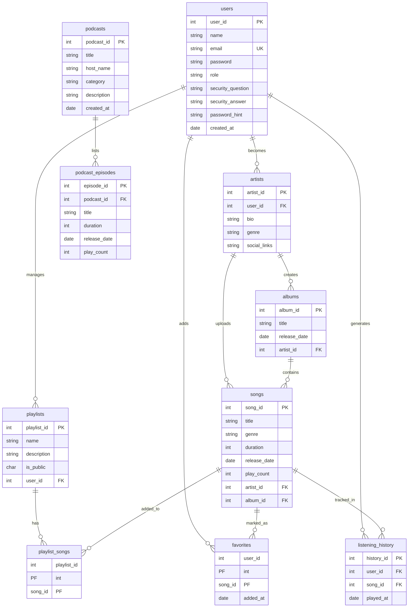

# 🎵 RevPlay - Enterprise Music & Podcast Management System

RevPlay is a comprehensive, enterprise-grade Java application designed for high-performance music and podcast streaming management. Built on the **N-Tier Architecture** pattern, it provides a feature-rich CLI environment for both casual listeners and professional creators.

---

## 📊 Entity Relationship Diagram (ERD)

<p align="center">
  
</p>

📌 This ERD represents all core entities such as Users, Artists, Albums, Songs, Podcasts, Playlists, Favorites, and Listening History along with their relationships, primary keys, and foreign key constraints.

## 🏛 Application Architecture (N-Tier / Layered Design)

<p align="center">
  
</p>

📌 The diagram illustrates the complete modular architecture of RevPlay:
- Presentation Layer (CLI / Menu Handling)
- Service Layer (Business Logic & Orchestration)
- DAO Layer (JDBC-based Data Access)
- Model Layer (POJOs)
- Database Layer (Oracle XE)

This design ensures separation of concerns, scalability, and maintainability.

## 🏗 Project Structure

The project follows a modular, layered architecture to ensure separation of concerns and scalability:

```text
revplay/
├── src/main/java/com/revplay/
│   ├── main/               # Presentation Layer: Entry point and UI logic
│   │   ├── RevPlayApp.java         # Master controller with main()
│   │   └── RevPlayAppMethonds.java # UI workflow and Menu handlers
│   ├── service/            # Service Layer: Business logic and orchestrations
│   │   ├── UserService / PlaylistService / PodcastService / SongService
│   │   └── ArtistService / AlbumService / ArtistSongService
│   ├── dao/                # Data Layer: Direct JDBC database interactions
│   │   ├── UserDAO / PlaylistDAO / PodcastDAO / SongDAO
│   │   ├── FavoriteDAO / ListeningHistoryDAO / ArtistDAO
│   │   └── AlbumDAO / ArtistSongDAO
│   ├── model/              # Domain Layer: POJOs representing DB entities
│   │   └── User, Song, Podcast, Episode, Artist, Album, Playlist, etc.
│   └── util/               # Utility Layer
│       └── DBConnection.java       # Centralized JDBC connection pool logic
├── src/test/java/com/revplay/test/ # Test Layer: JUnit 5 Service Tests
│   ├── AlbumServiceTest / SongServiceTest / UserServiceTest
│   ├── PlaylistServiceTest / PodcastServiceTest / BasicTest
│   └── SuiteClassMain.java         # Master Test Suite for all service layers
├── src/main/resources/     # Resource Layer
│   └── log4j2.xml                  # Enterprise logging configuration
├── pom.xml                 # Maven configuration and dependencies (JUnit 5, Oracle, Log4j2)
└── README.md               # Project documentation
```

## 📂 Project Documentation & Resources

- 📘 **Project Planning**  
  👉 [planning.txt](docs/planning.txt)

- 🗄️ **Database Scripts (Oracle SQL)**  
  👉 [oracleSQL.sql](docs/oracleSQL.sql)

- 📊 **Project Presentation**  
  👉 [RevPlay_Project_Presentation.pptx](docs/RevPlay_Project_Presentation.pptx)

- 📝 **Detailed Project Notes**  
  👉 [RevPlayNotes.docx](docs/RevPlayNotes.docx)


---

## 🔄 Working Flow

### 1. Initialization & Authentication
- **App Start**: `RevPlayApp` initializes the database connection and loads the main menu.
- **Role Assignment**: During registration, users choose between **USER** or **ARTIST**.
- **Login**: `UserService` validates credentials against the Oracle database and routes users to their respective dashboards.

### 2. User Workflow (The Listener)
- **Discovery**: Users perform keyword searches or browse content by Genre, Artist, or Album via `SongService`.
- **Engagement**: Play songs or podcasts with built-in controls (Pause/Resume/Repeat). `ListeningHistory` is updated automatically.
- **Personalization**: Users manage private/public playlists and "Favorite" tracks via `PlaylistService` and `FavoriteDAO`.

### 3. Artist Workflow (The Creator)
- **Profile Setup**: Artists initialize their professional bio and social links.
- **Content Pipeline**: 
    - **Music**: Create Albms -> Upload Songs -> Manage tracks.
    - **Podcasts**: Create Podcasts -> Manage Episodes.
- **Management**: full **CRUD** (Create, Read, Update, Delete) capabilities for all hosted content.
- **Analytics**: Real-time tracking of song play counts and podcast episode engagement via the Analytics dashboard.

---

## ✨ Enterprise Features

- **🚀 Transactional Integrity**: Critical operations like "Delete Podcast" or "Delete Playlist" use atomic SQL transactions to ensure no orphaned data remains.
- **🔍 Global Search Engine**: A unified search interface that probes both music and podcast repositories simultaneously.
- **🛡 Robust Security**: Password hint recovery systems and email duplication checks during registration.
- **📊 Real-time Stats**: Dynamic play-count incrementation every time a track or episode is streamed.
- **📜 Professional Logging**: Integrated `Log4j2` for tracking system health, search analytics, and error diagnostics.

---

## 🛠 Technology Stack
- **Language**: Java (Enterprise Edition logic)
- **Database**: Oracle XE (Relational Database Service)
- **Persistence**: JDBC (Java Database Connectivity)
- **Testing**: JUnit 5 (JUnit Jupiter & JUnit Platform Suite)
- **Build System**: Maven
- **Logging**: Apache Log4j2

---

## � DB Schema (ERD) - Coding Representation



---

## �📝 About the Creator
Created with ❤️ by **Manjunath**.
*A showcase of clean code, architectural best practices, and enterprise system design.*
